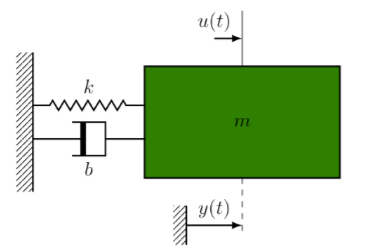
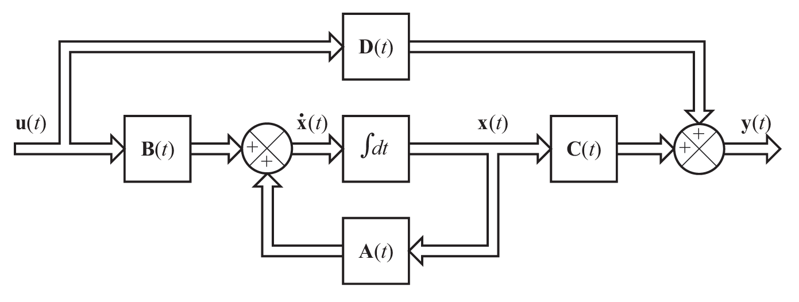
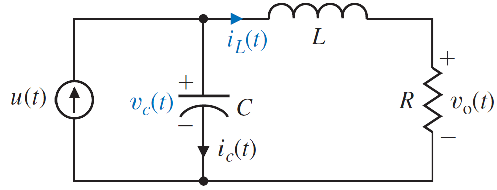
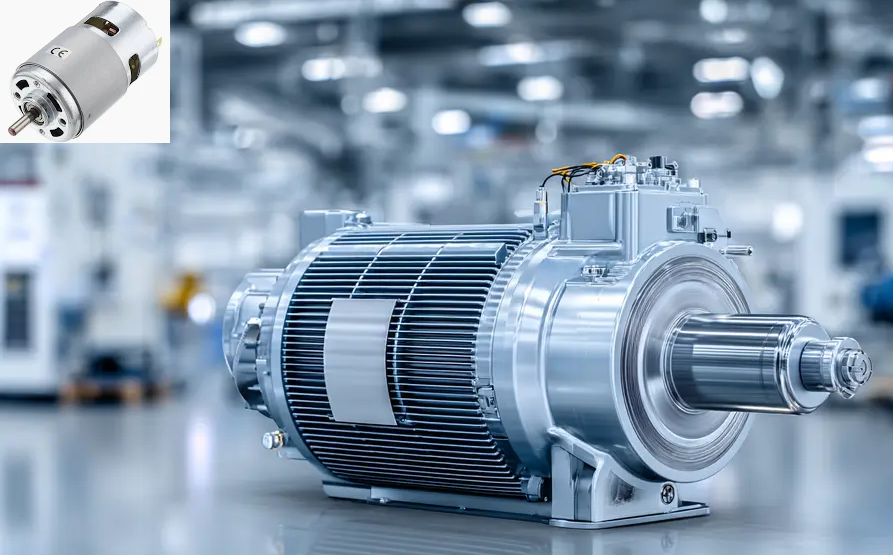
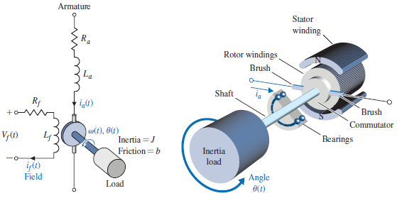

## Sistema massa mola amortecedor

{width=60%}

---

## Sistema massa mola amortecedor

Modelagem pelas Leis de Newton, considerando as forças atuantes na massa.

$$m\ddot{y} = u(t) - f_m(t) - f_a(t)$$

Onde:

- $m$ é a massa;
- $u(t)$ é a força de entrada;
- $f_m(t) = k y(t)$ é a força da mola;
- $f_a(t) = b \dot{y}(t)$ é a força de amortecimento;

Rearranjando a equação:

$$m\ddot{y} + b\dot{y} + ky(t) = u(t)$$

---

## Sistema massa mola amortecedor

Definindo as variáveis de estado:
$$x_1 = y(t) \qquad \longrightarrow \qquad \dot{x}_1 = x_2(t)$$
$$x_2 = \dot{y}(t) \qquad \longrightarrow \qquad \dot{x}_2 = \ddot{y}(t)$$

Expressando na forma matricial:
$$\begin{bmatrix} \dot{x}_1 \\ \dot{x}_2 \end{bmatrix} = \begin{bmatrix} 0 & 1 \\ -\frac{k}{m} & -\frac{b}{m} \end{bmatrix} \begin{bmatrix} x_1 \\ x_2 \end{bmatrix} + \begin{bmatrix} 0 \\ \frac{1}{m} \end{bmatrix} u$$
$$y = \begin{bmatrix} 1 & 0 \end{bmatrix} \begin{bmatrix} x_1 \\ x_2 \end{bmatrix}$$

---

## Modelagem no espaço de estados

Uma equação diferencial de ordem $n$ pode ser representada na forma de espaço de estados, por $n$ equações diferenciais de primeira ordem.

$$\begin{equation}
\frac{d^n y}{dt^n} + a_{n-1} \frac{d^{n-1} y}{dt^{n-1}} + \ldots + a_1 \frac{dy}{dt} + a_0 y = b_0 u
\end{equation}$$

$$
\begin{equation}
\begin{cases}
\dot{x}_1(t) = x_2(t) \\
\dot{x}_2(t) = x_3(t) \\
\vdots \\
\dot{x}_{n-1}(t) = x_n(t) \\
\dot{x}_n(t) = -a_{n-1} x_n(t) - a_{n-2} x_{n-1}(t) - \ldots - a_1 x_2(t) - a_0 x_1(t) + b_0 u(t)
\end{cases}
\end{equation}
$$

---

## Modelagem no espaço de estados - Forma matricial

$$\begin{equation}
\begin{bmatrix}
\dot{x}_1(t) \\
\dot{x}_2(t) \\
\vdots \\
\dot{x}_{n-1}(t) \\
\dot{x}_n(t)
\end{bmatrix} =
\begin{bmatrix}
0 & 1 & 0 & \ldots & 0 \\
0 & 0 & 1 & \ldots & 0 \\
\vdots & \vdots & \vdots & \ddots & \vdots \\
0 & 0 & 0 & \ldots & 1 \\
-a_0 & -a_1 & -a_2 & \ldots & -a_{n-1}
\end{bmatrix}
\begin{bmatrix}
x_1(t) \\
x_2(t) \\
\vdots \\
x_{n-1}(t) \\
x_n(t)
\end{bmatrix} +
\begin{bmatrix}
0 \\
0 \\
\vdots \\
0 \\
b_0
\end{bmatrix} u(t)
\end{equation}
$$

$$\begin{equation}
y(t) = \begin{bmatrix}1 & 0 & 0 & \ldots & 0\end{bmatrix} \begin{bmatrix}
x_1(t) \\ 
x_2(t) \\
\vdots \\
x_{n-1}(t) \\
x_n(t)
\end{bmatrix}
\end{equation}
$$

---

### Equação de Estado - Sistema LIT de ordem $n$
$$\dot{\mathbf{x}} = \mathbf{A}\mathbf{x} + \mathbf{B}u$$
$$\mathbf{y} = \mathbf{C}\mathbf{x} + \mathbf{D}u$$

Onde:

- $\mathbf{x} \in \mathbb{R}^n$ é o vetor de estado;
- $u \in \mathbb{R}$ é a entrada do sistema;
- $\mathbf{y} \in \mathbb{R}^p$ é a saída do sistema;
- $\mathbf{A} \in \mathbb{R}^{n \times n}$ é a matriz de estado;
- $\mathbf{B} \in \mathbb{R}^{n \times m}$ é a matriz de entrada; 
- $\mathbf{C} \in \mathbb{R}^{p \times n}$ é a matriz de saída;
- $\mathbf{D} \in \mathbb{R}^{p \times m}$ é a matriz de transmissão direta.
- $m$ é o número de entradas do sistema;
- $p$ é o número de saídas do sistema.

---

# Diagrama de blocos - Modelo de estados

{width=80%}

---

## Circuito RLC

{width=80%}

---

## Modelagem - Circuito RLC

::: {.columns}

::: {.column width="50%"}

Equação no nó LKC:
$$u(t) = i_C(t) + i_L(t)$$

$$u(t) = C \frac{dv_C(t)}{dt} + i_L(t)$$
Equação no ramo L-R:

$$v_C(t) = v_L(t) + v_R(t)$$
$$v_C(t) = L \frac{di_L(t)}{dt} + R i_L(t)$$

:::

::: {.column width="50%"}
 O que resulta:
$$C\frac{dv_C(t)}{dt} = u(t) - i_L(t)$$
$$L\frac{di_L(t)}{dt} = v_C(t) - R i_L(t)$$

{width=80%}
:::

:::

---

## Modelagem - Circuito RLC

Definindo as variáveis de estado:
$$x_1 = v_C(t) \qquad \longrightarrow \qquad \dot{x}_1 = \frac{1}{C} (u(t) - i_L(t))$$
$$x_2 = i_L(t) \qquad \longrightarrow \qquad \dot{x}_2 = \frac{1}{L} (x_1(t) - R x_2(t))$$

Expressando na forma matricial:
$$\begin{bmatrix} \dot{x}_1 \\ \dot{x}_2 \end{bmatrix} = \begin{bmatrix} 0 & -\frac{1}{C} \\ \frac{1}{L} & -\frac{R}{L} \end{bmatrix} \begin{bmatrix} x_1 \\ x_2 \end{bmatrix} + \begin{bmatrix} \frac{1}{C} \\ 0 \end{bmatrix} u$$
$$y = \begin{bmatrix} 0 & R \end{bmatrix} \begin{bmatrix} x_1 \\ x_2 \end{bmatrix}$$

--- 

## Solução da equação de estados

Considerando uma equação de 1a ordem:

$$\dot{x}(t) = ax(t) + bu(t)$$

Aplicando transformada de Laplace:

$$sX(s) - x(0) = aX(s) + bU(s)$$

Rearranjando:
$$X(s) = \frac{x(0)}{s-a} + \frac{b}{s-a} U(s)$$

Ou seja, a resposta do sistema é composta por uma resposta natural (devido à condição inicial) e uma resposta forçada (devido à entrada).

$$
x(t) = e^{at} x(0) + \int_0^t e^{a(t-\tau)} b u(\tau) d\tau
$$

---

## Solução da equação de estados

Para um sistema de ordem $n$:

$$\dot{\mathbf{x}} = \mathbf{A}\mathbf{x} + \mathbf{B}u$$

Aplicando transformada de Laplace:
$$s\mathbf{X}(s) - \mathbf{x}(0) = \mathbf{A}\mathbf{X}(s) + \mathbf{B}U(s)$$
Rearranjando:
$$\mathbf{X}(s) = (s\mathbf{I} - \mathbf{A})^{-1} \mathbf{x}(0) + (s\mathbf{I} - \mathbf{A})^{-1} \mathbf{B} U(s)$$

No tempo:

$$\mathbf{x}(t) = e^{\mathbf{A}t} \mathbf{x}(0) + \int_0^t e^{\mathbf{A}(t-\tau)} \mathbf{B} u(\tau) d\tau$$

---

## Modelagem do motor de corrente contínua

{width=80%}

---

## Modelagem do motor de corrente contínua 

{width=80%}
