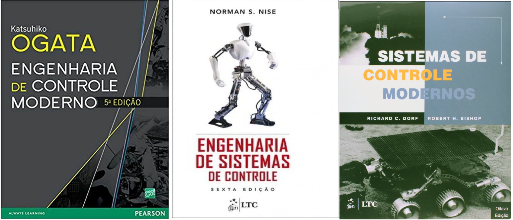

## Sistemas de Controle II

:::{.columns}
::: {.column width="50%"}
 - 6o semestre do curso de Engenharia Elétrica
 - Carga horária: 60 horas
 - Presencial
 - Requisitos: Análise de Sistemas Lineares e Sistemas de Controle I; 
 - Aborda teoria de controle em espaços de estados e controle digital.

:::
::: {.column width="50%"}

  - **Ementa Espaço de Estados**: Modelagem de sistemas físicos; Representação em espaço de estados; Análise de sistemas no espaço de estados; Controle de sistemas no espaço de estados; Observadores de estado; Projeto de controladores e observadores; Controe de sistemas não lineares; Linearização; Estabilidade, controlabilidade e observabilidade; Regulação e Rastreamento.

  - **Ementa Controle Digital**: Controle digital; Amostragem e reconstrução de sinais; Sinais e sistemas discretos; Transformada $Z$;Análise de sistemas amostrados; Projeto de controladores digitais; Implementação de controladores digitais.

:::
:::

---

## Bibliografia

- **Livro  1**: Ogata, Katsuhiko. "Engenharia de Controle Moderno" 5th Edition. Prentice Hall, 2010.
- **Livro  2**: Nise, Norman S. "Engenharia de Sistemas de Controle." 7th Edition. Wiley, 2015.
- **Livro  3**: Dorf, Richard. "Sistemas de Controle Moderno." 13th Edition. Pearson, 2016.

{width=60%}

---

## Conteúdo e avaliação: Espaço de estados

- Teste 1 - $T_1$: 3,0 pts - Modelagem, Conversão de representações e análise de estabilidade;
- Teste 2 - $T_2$: 3,0 pts - Sistemas não lineares e linearização, estabilidade, controlabilidade, observabilidade e projeto de controladores por alocação de polos;
- Teste 3 -  $T_3$: 4,0 pts - Projeto de controladores por alocação de polos e observadores de estado; Regulação e Rastreamento;

Nota 1: $N_1 = T_1 + T_2 + T_3$

Testes de 1hora com uma ou duas questões.

---

## Conteúdo e avaliação: Controle Digital

- Teste 4 - $T_4$: 2,5 pts - Discretização de sinais, teorema da amostragem, equações de diferença;
- Teste 5 - $T_5$: 3,5 pts - Transformada Z, função de transferência discreta; Análise de sistemas amostrados;
- Teste 6 -  $T_6$: 4,0 pts - Projeto de controle digital por emulação;

Nota 2: $N_2 = T_4 + T_5 + T_6$

Testes de 1hora com uma ou duas questões.

---

## Avaliação Final

- Nota Final: $N_f = \dfrac{N_1 + N_2}{2}$

- Nota_1 ou a Nota_2 podem ser substituídas por exame final com todo o conteúdo de epaço de estados ou de controle digital, respectivamente.

- Frequencia mínima: 75% [Regulamento de Graduação da UFPA](https://proeg.ufpa.br/images/Artigos/Academico/Downloads/Regulamento_de_Graduacao.pdf), Art. 18.

**Conceitos:**

- $N_f \geq 9,0$: EXC - Excelente.
- $7,0 \leq N_f < 9,0$: BOM - Bom.
- $5,0 \leq N_f < 7,0$: REG - Regular
- $N_f < 5,0$: INS - Insuficiente.

--- 

## Plano de Ensino

- [25/03] - Plano de ensino; Introdução aos modelos de estado; Modelagem massa mola amortecedor;
- [01/04] - Modelagem espaço de estados, forma vetorial matricial, diagrama de blocos; Modelagem circuiro RLC;Simulação Matlab (script);
- [02/04] - Modelagem motor CC; Simulação simulink;Conversão de representações: Forma de estado para função de transferência; Análise de estabilidade: Polos - Autovalores de $A$;
- [08/04] - Conversão de representações: Função de transferência para espaço de estados; Formas canônicas;
- [09/04] - Exercícios de modelagem e conversão de representações; 
- [15/04] -Teste 1 - $T_1$; Correção do teste 1;

--- 

## Plano de Ensino

- [16/04] - Controladores por alocação de polos; Estabilidade, controlabilidade; Especificação de desempenho;Projeto de controladores por alocação de polos;
- [22/04] - Forma canônica controlável e o projeto de controladores por alocação de polos;
- [23/04] - Exercícios de controladores por alocação de polos; 
- [29/04] - Exercícios de controladores por alocação de polos; 
- [30/04] - Teste 2 - $T_2$; Correção do teste 2;

--- 

## Plano de Ensino

- [06/05] - Observadores de estado; Observabilidade; Projeto de observadores de estado;
- [07/05] - Projeto de controladores por alocação de polos e observadores de estado; 
- [13/05] - Regulação e Rastreamento; Exercícios de projeto de controladores e observadores;
- [14/05] - Exercícios de projeto de controladores e observadores;
- [20/05] - Exercícios de projeto de controladores e observadores;
- [21/05] - Teste 3 - $T_3$; Correção do teste 3;

--- 

## Plano de Ensino

- [27/05] - Sistemas de controle digital; Amostragem e reconstrução de sinais; Sinais e sistemas discretos;
- [28/05] - Transformada $Z$; Análise de sistemas amostrados; Projeto de controladores digitais por emulação;
- [03/06] - Exercícios de controle digital;

.... **Em construção** ....

