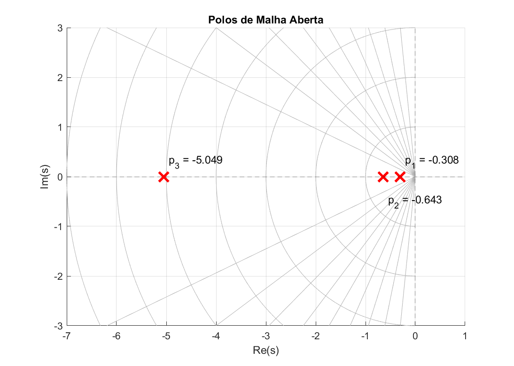

## Espaço de Estados e Polos de Malha Aberta

Consideramos sistemas LIT representados em espaço de estados:

$$\begin{cases}
\dot{x}(t) = Ax(t) + Bu(t) \\
y(t) = Cx(t)
\end{cases}$$

Os **polos de malha aberta** são os autovalores de $A$:

$$\det(sI - A) = 0$$

::: {.callout-important title="Problema"}
E se os **polos de malha aberta** não atenderem às especificações de desempenho desejadas?
:::

---

## Sistema de Exemplo: Polos de Malha Aberta

$$A = \begin{bmatrix} 0 & 1 & 0 \\ 0 & 0 & 1 \\ -1 & -5 & -6 \end{bmatrix} \implies \det(sI - A) = s^3 + 6s^2 + 5s + 1 = 0$$

**Polos de malha aberta:**  $p_1 \approx -0{,}308 \qquad p_2 \approx -0{,}643 \qquad p_3 \approx -5{,}049$.

:::: {.columns}
::: {.column width="50%"}
{width=100% fig-align="center"}
:::
::: {.column width="50%"}
::: {.callout-important title="Análise"}
- Sistema **estável** — polos no semiplano esquerdo.
- $p_1$ e $p_2$ próximos do eixo imaginário — resposta **lenta**.
- $p_3$ rápido e não dominante.
- Dominado pelos polos lentos — **não atende especificações típicas**.
:::
:::
::::

---

## Motivação: Por que alocar polos?

A posição dos polos determina o comportamento dinâmico do sistema:

$$G(s) = \frac{K\omega_n}{s^2 + 2\xi\omega_n s + \omega_n^2} \quad\implies\quad \text{polos} = -\xi\omega_n \pm j\omega_n\sqrt{1-\xi^2}$$

| Especificação | Relação com os polos |
|---|---|
| Estabilidade | Polos no semiplano esquerdo |
| Tempo de acomodação | Parte real $\xi\omega_n$ |
| Frequência de oscilação | $\omega_d = \omega_n\sqrt{1-\xi^2}$ |
| Sobressinal | Fator de amortecimento $\xi$ |

::: {.callout-important title="Ideia Central"}
Polos de malha fechada bem posicionados $\implies$ especificações de desempenho atendidas.
:::

---

## Diagrama de Blocos: Malha Aberta

$$\begin{cases}
\dot{x}(t) = Ax(t) + Bu(t) \\
y(t) = Cx(t)
\end{cases}$$

```{tikz}
%| echo: false
%| fig-align: center
\usetikzlibrary{arrows.meta, positioning, calc}
\input{imgs/tikz/DiagramaSSMalhaAberta.tikz}
```

---

## Lei de Controle por Realimentação de Estados

Sinal de controle como combinação linear dos estados:

$$u(t) = -Kx(t) + r(t)$$

onde $K = \begin{bmatrix} k_1 & k_2 & \cdots & k_n \end{bmatrix}$ é o **vetor de ganhos** e $r(t)$ a referência. Substituindo:

$$\dot{x}(t) = Ax(t) + B\bigl(-Kx(t) + r(t)\bigr)$$

**Sistema em malha fechada:**

$$\begin{cases}
\dot{x}(t) = (A - BK)x(t) + Br(t) \\
y(t) = Cx(t)
\end{cases}$$

::: {.callout-note title="Observação"}
A realimentação modifica a matriz dinâmica: $A \rightarrow A_{cl} = A - BK$.
Os autovalores de $A_{cl}$ são os **polos de malha fechada**.
:::

---

## Sistema Controlado — Diagrama de Blocos

```{tikz}
%| echo: false
%| fig-align: center
\usetikzlibrary{arrows.meta, positioning, calc}
\input{imgs/tikz/DiagramaSSMalhaFechada.tikz}
```

::: {.callout-note title="Observação"}
O ganho $K$ **realimenta todos os estados** $x(t)$ — não apenas a saída $y(t)$.
Diferente da realimentação de saída clássica.
:::

---

## Efeito da Realimentação sobre os Polos

Matriz de malha fechada: $A_{cl} = A - BK$.

**Polos de malha fechada** — autovalores de $A_{cl}$:

$$\det\bigl(sI - (A - BK)\bigr) = 0$$

::: {.callout-important title="Alocação de Polos"}
Com $K$ adequado, os polos de malha fechada podem ser posicionados em qualquer lugar do plano complexo — desde que o sistema seja **controlável**.
:::

---

## Sistema controlável e Controlabilidade

::: {.callout-important title="Questão fundamental"}
Dado $\dot{x} = Ax + Bu$, sempre existe $K$ que posicione os polos arbitrariamente?
:::

**Não necessariamente.** Depende da capacidade de $u$ em **influenciar** os estados.

- Estado $x_i$ não influenciado por $u$ — direta ou indiretamente — não é controlável.
- Polos associados a estados não controláveis **não podem ser movidos**.

::: {.callout-note title="Condição necessária"}
A alocação arbitrária de polos exige que o sistema seja **completamente controlável**.
:::

---

## Condição de Controlabilidade

O sistema $\dot{x} = Ax + Bu$ é **completamente controlável** se e somente se:

$$\text{posto}(\mathcal{C}) = n, \quad \mathcal{C} = \begin{bmatrix} B & AB & A^2B & \cdots & A^{n-1}B \end{bmatrix}$$

onde $n$ é a ordem do sistema.

$$\text{rank}(\mathcal{C}) = \text{posto}(\mathcal{C}) = n, \det(\mathcal{C}) \neq 0.  \text{ Ou seja:} \mathcal{C} \text{é invertível!}$$

::: {.callout-note title="Interpretação"}
Controlabilidade garante a existência de $K$ capaz de levar o sistema a qualquer estado em tempo finito.
:::

---

## Controlabilidade: Exemplo

**Sistema não controlável** — considere:

$$A = \begin{bmatrix} -1 & 0 \\ 0 & -2 \end{bmatrix}, \quad B = \begin{bmatrix} 1 \\ 0 \end{bmatrix}$$

A matriz de controlabilidade:

$$\mathcal{C} = \begin{bmatrix} B & AB \end{bmatrix} = \begin{bmatrix} 1 & -1 \\ 0 & 0 \end{bmatrix}$$

$$\det(\mathcal{C}) = 0 \implies \text{posto}(\mathcal{C}) = 1 < n = 2$$

::: {.callout-important title="Conclusão"}
O estado $x_2$ não é influenciado por $u$ — o polo em $s = -2$ **não pode ser movido**.
A alocação arbitrária de polos é **impossível** para este sistema.
:::

---

## Polinômio Característico Desejado

Polos desejados $p_1, p_2, \ldots, p_n$ definem o **polinômio característico desejado**:

$$\alpha(s) = (s - p_1)(s - p_2)\cdots(s - p_n) = s^n + \alpha_{n-1}s^{n-1} + \cdots + \alpha_1 s + \alpha_0$$

**Objetivo:** encontrar $K$ tal que:

$$\det\bigl(sI - (A - BK)\bigr) = \alpha(s)$$

::: {.callout-note title="Em outras palavras"}
O polinômio característico de $A_{cl} = A - BK$ deve coincidir **exatamente** com $\alpha(s)$.
:::

---

## Fórmula de Ackermann

Igualando coeficientes de $\det\bigl(sI - (A - BK)\bigr) = \alpha(s)$, obtêm-se **$n$ equações** nas **$n$ incógnitas** $k_1, \ldots, k_n$.

Para sistemas controláveis, a solução é dada pela **fórmula de Ackermann**:

$$\boxed{K = \begin{bmatrix} 0 & \cdots & 0 & 1 \end{bmatrix} \mathcal{C}^{-1} \,\alpha(A)}$$

onde $\alpha(A)$ é o polinômio desejado **avaliado na matriz** $A$:

$$\alpha(A) = A^n + \alpha_{n-1}A^{n-1} + \cdots + \alpha_1 A + \alpha_0 I$$

::: {.callout-tip title="Intuição"}
$\mathcal{C}^{-1}$ desfaz a estrutura do sistema — $\alpha(A)$ impõe a dinâmica desejada.
:::

---

## Exemplo Numérico

Determinar $K$ para o sistema que atenda aos polos desejados:

$$A = \begin{bmatrix} 0 & 1 & 0 \\ 0 & 0 & 1 \\ -1 & -5 & -6 \end{bmatrix}, \quad
B = \begin{bmatrix} 0 \\ 0 \\ 1 \end{bmatrix}$$
Polos desejados: $\boxed{p_1 = -2 + j4, \quad p_2 = -2 - j4, \quad p_3 = -10}$

::: {.callout-note title="Roteiro"}
:::: {.columns}
::: {.column width="50%"}
1. Verificar controlabilidade
2. Calcular $\alpha(s)$
:::
::: {.column width="50%"}
3. Avaliar $\alpha(A)$
4. Aplicar a fórmula de Ackermann
:::
::::
:::
---

## Passo 1 — Verificar Controlabilidade

Calculamos a matriz de controlabilidade $\mathcal{C} = \begin{bmatrix} B & AB & A^2B \end{bmatrix}$:

$$AB = \begin{bmatrix}0\\1\\-6\end{bmatrix}, \quad
A^2B = \begin{bmatrix}1\\-6\\31\end{bmatrix}$$

$$\mathcal{C} = \begin{bmatrix} 0 & 0 & 1 \\ 0 & 1 & -6 \\ 1 & -6 & 31 \end{bmatrix}$$

$$\det(\mathcal{C}) = 1 \neq 0 \implies \text{posto}(\mathcal{C}) = 3 = n \checkmark$$

::: {.callout-tip title="Conclusão"}
O sistema é **completamente controlável** — a alocação arbitrária de polos é possível.
:::

---

## Passo 2 — Polinômio Característico Desejado

A partir dos polos desejados:

$$\phi(s) = (s - p_1)(s - p_2)(s - p_3) = (s+2-j4)(s+2+j4)(s+10)$$

Agrupando o par complexo conjugado:

$$\phi(s) = (s^2 + 4s + 20)(s + 10)$$

Expandindo:

$$\boxed{\phi(s) = s^3 + 14s^2 + 60s + 200}$$

O polinômio característico desejado!

---

## Passo 3 — Avaliar $\phi(A)$

$$\phi(A) = A^3 + 14A^2 + 60A + 200I$$

Calculando as potências de $A$:

$$A^2 = \begin{bmatrix} 0 & 0 & 1 \\ -1 & -5 & -6 \\ 5 & 25 & 31 \end{bmatrix}, \quad
A^3 = \begin{bmatrix} -1 & -5 & -6 \\ 5 & 25 & 31 \\ -25 & -125 & -181 \end{bmatrix}$$

Somando termo a termo:

$$\phi(A) = \begin{bmatrix} 199 & -10 & -6 \\ -4 & 80 & 1 \\ -20 & -100 & 0 \end{bmatrix}$$

---

## Passo 4 — Aplicar a Fórmula de Ackermann

$$K = \begin{bmatrix} 0 & 0 & 1 \end{bmatrix} \mathcal{C}^{-1} \,\phi(A)$$

:::: {.columns}
::: {.column width="50%"}
Calculando $\mathcal{C}^{-1}$:

$$\mathcal{C}^{-1} = \begin{bmatrix} 5 & 6 & 1 \\ 6 & 1 & 0 \\ 1 & 0 & 0 \end{bmatrix}$$
:::
::: {.column width="50%"}
Calculando $\mathcal{C}^{-1}\phi(A)$:

$$\mathcal{C}^{-1}\phi(A) = \begin{bmatrix} 940 & 1186 & 199 \\ 1186 & 489 & 55 \\ 199 & 55 & 8 \end{bmatrix}$$
:::
::::

O vetor $\begin{bmatrix} 0 & 0 & 1 \end{bmatrix}$ seleciona a **última linha**:

$$\boxed{K = \begin{bmatrix} 199 & 55 & 8 \end{bmatrix}}$$

---

## Passo 5 — Verificação

A lei de controle $u = -Kx$ resulta em $A_{cl} = A - BK$:

$$A_{cl} = \begin{bmatrix} 0 & 1 & 0 \\ 0 & 0 & 1 \\ -1 & -5 & -6 \end{bmatrix} - \begin{bmatrix} 0 \\ 0 \\ 1 \end{bmatrix}\begin{bmatrix} 199 & 55 & 8 \end{bmatrix} = \begin{bmatrix} 0 & 1 & 0 \\ 0 & 0 & 1 \\ -200 & -60 & -14 \end{bmatrix}$$

O polinômio característico de $A_{cl}$:

$$\det(sI - A_{cl}) = s^3 + 14s^2 + 60s + 200 = \phi(s) \checkmark$$

::: {.callout-tip title="Conclusão"}
Os polos de malha fechada são exatamente $p_1 = -2+j4$, $p_2 = -2-j4$, $p_3 = -10$ ✓
:::


---

## Implementação em MATLAB

::: {style="font-size: 0.8em;"}
```matlab
% Matrizes do sistema:

A = [0  1  0;
     0  0  1;
    -1 -5 -6];

B = [0; 0; 1];

% Polos desejados:
p = [-2+4j, -2-4j, -10];

% Verificar controlabilidade
Co = ctrb(A, B);
fprintf('Posto de C: %d\n', rank(Co));

% Ganho via Ackermann
K = acker(A, B, p);
fprintf('K = [%.0f  %.0f  %.0f]\n', K(1), K(2), K(3));

% Matriz de malha fechada
Acl = A - B*K;
fprintf('Polos de malha fechada:\n');
disp(eig(Acl))
```
:::

::: {.callout-note title="acker vs place"}
`acker` implementa a fórmula de Ackermann — adequado para sistemas SISO de baixa ordem. Para sistemas de ordem elevada, prefira `place` (algoritmo de Kautsky-Nichols), numericamente mais robusto e que também suporta sistemas MIMO.
:::

---

## Limitações e Considerações Práticas

::: {.incremental}
- A fórmula de Ackermann é exata para sistemas **SISO** — para sistemas MIMO, há outros métodos (e.g., alocação por realimentação de saída).
- Polos muito distantes do eixo imaginário exigem **ganhos elevados**, podendo amplificar ruído e saturar atuadores.
- O projeto completo inclui também um **observador de estados** quando os estados não são todos mensuráveis.
- A escolha dos polos desejados deve levar em conta especificações de desempenho: tempo de acomodação, sobressinal, largura de banda.
:::

---

## Resumo

| Etapa | Operação |
|-------|----------|
| 1. Controlabilidade | $\text{posto}(\mathcal{C}) = n$? |
| 2. Polinômio desejado | $\alpha(s) = \prod_i(s - p_i)$ |
| 3. Avaliar $\alpha(A)$ | Substituir $s \to A$ |
| 4. Ganho de Ackermann | $K = e_n^T \mathcal{C}^{-1} \alpha(A)$ |
| 5. Verificação | $\text{eig}(A - BK) \stackrel{?}{=} \{p_i\}$ |

---

## Exercício Proposto

Dado o sistema:

$$A = \begin{bmatrix} 0 & 1 \\ -2 & -3 \end{bmatrix}, \quad B = \begin{bmatrix} 0 \\ 1 \end{bmatrix}$$

1. Verifique a controlabilidade.
2. Projete $K$ pela fórmula de Ackermann para polos em $s = -4 \pm j2$.
3. Verifique os polos de malha fechada.
4. Simule a resposta ao degrau unitário para $x_0 = \mathbf{0}$ e $r(t) = 1$.

---

## {.center data-background-color="#535353"}

:::{style="display: flex; flex-direction: column; align-items: center; justify-content: center; height: 70vh; gap: 2rem;"}

{width="220px"}

[Prof. Dr. Raphael Teixeira]{style="color: #cccccc; font-size: 2.2rem;"}

[raphaelbt@ufpa.br]{style="color: #b6cefb; font-size: 2.2rem;"}

:::