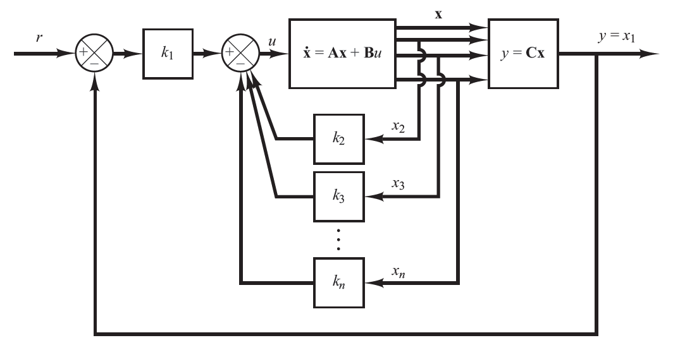

## Motivação: Rastreamento de Referência

No projeto por alocação de polos, a lei de controle $u = -Kx$ **regula** o sistema — leva os estados à origem.

**Problema:** e se o objetivo for **rastrear uma referência** $r(t) \neq 0$?

:::: {.columns}
::: {.column width="50%"}
**Regulador**
$$u(t) = -Kx(t)$$
- Objetivo: $x(t) \to 0$
- Referência: $r(t) = 0$
:::
::: {.column width="50%"}
**Servosistema**
$$u(t) = -Kx(t) + k_r \, r(t)$$
- Objetivo: $y(t) \to r(t)$
- Referência: $r(t) \neq 0$
:::
::::

::: {.callout-important title="Questão central"}
Como projetar $K$ e $k_r$ para que $y(t) \to r(t)$ em regime permanente?
:::

---

## Erro em Regime Permanente

Sistema em malha fechada com pré-compensação $k_r$:

$$\begin{cases}
\dot{x}(t) = (A - BK)x(t) + Bk_r\, r(t) \\
y(t) = Cx(t)
\end{cases}$$

Em regime permanente ($\dot{x} = 0$):

$$x_{ss} = -(A - BK)^{-1}Bk_r\, r$$

$$y_{ss} = Cx_{ss} = -C(A - BK)^{-1}Bk_r\, r$$

**Erro estacionário:**

$$e_{ss} = r - y_{ss} = \left[1 + C(A-BK)^{-1}Bk_r\right]r$$

::: {.callout-important title="Problema"}
Para $e_{ss} = 0$, é necessário ajustar $k_r$ — mas perturbações e incertezas no modelo podem introduzir erro residual.
:::

---

## Cálculo do Ganho de Pré-compensação $k_r$

Para $e_{ss} = 0$, impõe-se $y_{ss} = r$:

$$-C(A - BK)^{-1}Bk_r = 1$$

Resolvendo para $k_r$:

$$\boxed{k_r = -\frac{1}{C(A - BK)^{-1}B}}$$

::: {.callout-note title="Em MATLAB"}
```matlab
kr = -1 / (C * inv(A - B*K) * B');
```
:::

::: {.callout-important title="Limitação"}
$k_r$ é calculado com base no modelo nominal — perturbações ou incertezas paramétricas geram **erro estacionário residual**.
A solução robusta é incluir um **integrador** na malha de controle.
:::

---

## Lei de Controle: Abordagem de Ogata

O primeiro estado $x_1 = y$ é a saída do sistema. A lei de controle é:

$$u = -\begin{bmatrix} 0 & k_2 & k_3 & \cdots & k_n \end{bmatrix}x + k_1(r - x_1)$$

$$= -Kx + k_1 r$$

onde $K = \begin{bmatrix} k_1 & k_2 & \cdots & k_n \end{bmatrix}$ e o primeiro ganho $k_1$ atua no **erro** $e = r - x_1$.

Substituindo no modelo em espaço de estados:

$$\dot{x} = (A - BK)x + Bk_1 r$$

::: {.callout-note title="Observação"}
A estrutura é equivalente ao regulador $u = -Kx$ com pré-compensação $k_r = k_1$ — porém $k_1$ é determinado diretamente pelo projeto de alocação de polos, não por cálculo separado.
:::

---

## Servosistema: Diagrama de Blocos

{width=100% fig-align="center"}

::: {.callout-note title="Observação"}
O ganho de pré-compensação $k_r$ escala a referência para que a saída em regime permanente seja igual a $r$.
:::

---

## Sistema em Malha Fechada

Aplicando $u = -Kx + k_1 r$ ao modelo $\dot{x} = Ax + Bu$:

$$\dot{x} = (A - BK)x + Bk_1 r$$

Em regime permanente ($\dot{x} = 0$):

$$x_{ss} = -(A - BK)^{-1}Bk_1\, r$$

$$y_{ss} = Cx_{ss} = -C(A - BK)^{-1}Bk_1\, r$$

**Erro estacionário:**

$$e_{ss} = r - y_{ss} = \left[1 + C(A - BK)^{-1}Bk_1\right]r$$

::: {.callout-important title="Limitação"}
$e_{ss} = 0$ somente se o modelo for exato — perturbações e incertezas paramétricas introduzem **erro residual**.
A solução: incluir um **integrador** na malha de controle.
:::

---

## {.center data-background-color="#535353"}

:::{style="display: flex; flex-direction: column; align-items: center; justify-content: center; height: 70vh; gap: 2rem;"}

{width="220px"}

[Prof. Dr. Raphael Teixeira]{style="color: #cccccc; font-size: 2.2rem;"}

[raphaelbt@ufpa.br]{style="color: #b6cefb; font-size: 2.2rem;"}

:::